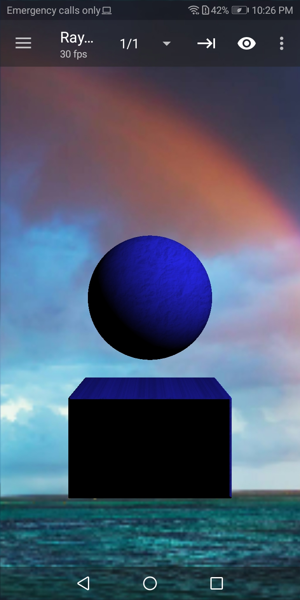
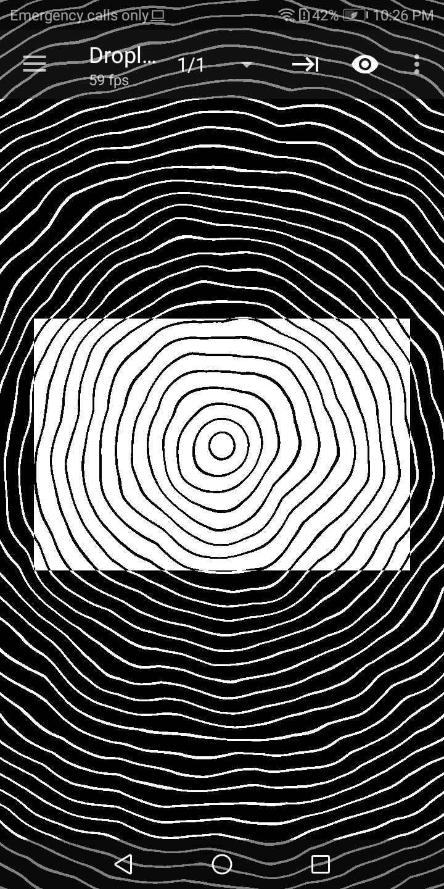
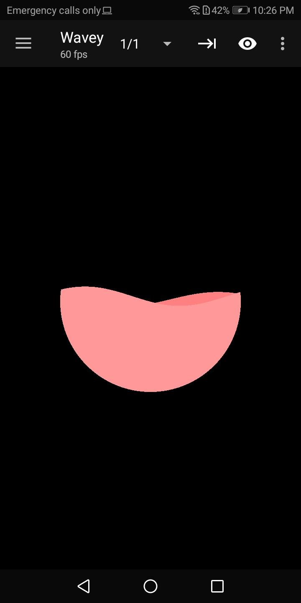
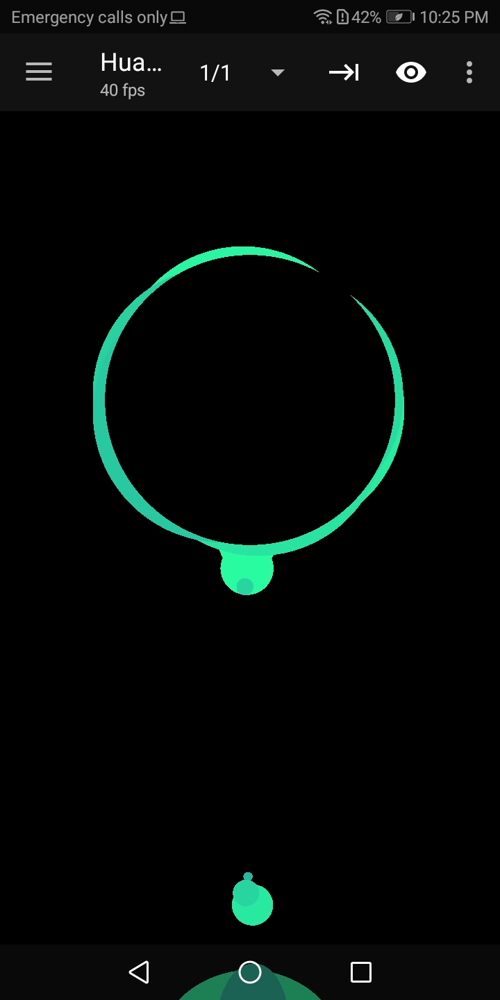

# CustomShaders
* You can find here a set of shaders that I wrote for different projects. Feel free to use them however you want.
* The shaders are organized by the shading language (GLSL or HLSL) and the tools that I used to create them.
* In order to achieve multi pass effects on a tool that doesn’t support such feature, some shaders are divided into multiple files.
* Each shader is only tested on the tool that I used to create it, using it in a different tool or environment might require some fixes and changes.
* You can find below a description of each shader with additional info (Screenshot, link to video or web preview)

***

## GLSL SHADERS
### 1. [Shadertoy](https://www.shadertoy.com/)

#### 1. Water Dance
* Interactive fluid simulation
* Implementation of Lattice-Boltzmann method in a fragment shader.
* **BufferA** is the pass where the simulation happen, densities are calculated and passed to the **Image** shader where data is processed to estimate normals and draw to the screen.
* Check the live preview [here](https://www.shadertoy.com/view/WsGGWt)
***

***
#### 2. Path of Light
* A procedural Raymarching Shader
* Composed of a terrain and Blackhole absorbing light
* The terrain SDF is made using a height-field by sampling one texture using different scales and different heights .It's then textured and shaded.

* The background is made using UV manipulation..
* Check the live preview [here](https://www.shadertoy.com/view/tsXcDr)
***

***

#### 3. Darth Vader
* A fully procedural Darth Vader helmet
* Rendered using raymarching and progressive stochastic shading
* The scene is composed using primitive SDFs, SDF operators and transformations.
* At each hit point on a surface, two rays are bounced in random direction depending on the material, these rays are for specular and for diffuse contribution
* Features inlude: PBR materials, emissive materials, Depth of Field, Specular and Diffuse.
* Not realtime rendering but interactive progressive rendering.
* Check the live preview [here](https://www.shadertoy.com/view/WdfBzr)
***

***

### 2. [Mobile Shader Editor](https://play.google.com/store/apps/details?id=de.markusfisch.android.shadereditor&hl=en)

#### 1. Raymarcher
* A raymcarcher that renders primitive shapes (sphere, cube) with diffuse lighting and some animation.
* View the video [here](https://twitter.com/AyoubKhammasi/status/1138141605930700801)
***

***

#### 2. Droplets
* An abstract black and white animation of droplets.
* View the video [here](https://twitter.com/AyoubKhammasi/status/1187099594435551233)
***

***

#### 3. WaveyCircleFilling
* A simple animation of a circle being filled with smooth waves.
* View the video [here](https://twitter.com/AyoubKhammasi/status/1137482053707083781)
***

***

#### 4. ChargingAnimation
* A recreation of the charging animation used in Huawei phones.
* View the video [here](https://twitter.com/AyoubKhammasi/status/1126928804562259968)
***

***

## HLSL SHADERS
### 1. [Unity](https://unity.com/)

#### 1. VolumeFiller
* If you assign it to an object, you can control how much of its volume is rendered using textureA and colorA, the rest will be rendered using textureB and colorB.

***

#### 1. SpriteSheetToTex3D
* A compute shader that can create a 3D texture out of a sprite sheet.
* Metadata must be passed through code or inspector before dispatching the shader.
* You have control over the distance between the sprites, and the values inside the gaps are linearly interpolated.

***
